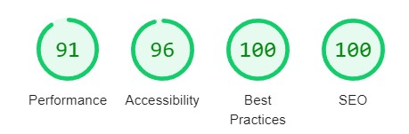

# You are now viewing a repository of a Car Rental Service App created by Michael Lykhovyd

This project was bootstrapped with [Create React App](https://github.com/facebook/create-react-app).

# Project Features:

-The project allows user to Search for cars within specific criterias.
- View the detailed information about an interesting car
- Add the the specific car to a favorites "wishlist".
- Rent a Car Feature allows to call the Car owner .

# Database Connection

Project is using https://mockapi.io/ database and REST API connections to get data from the database .

# Libraries used:

- axios
- mui/material
- formik
- react-router-dom
- redux-persist
- react-redux
- reduxjs/toolkit
- react-dom
- styled-components
- react-icons
- react-loader-spinner
- react-toastify

# I've tried to perform my best to complete this project within the limited time frame .
If you have found any bugs or issues please let me know.  :D

